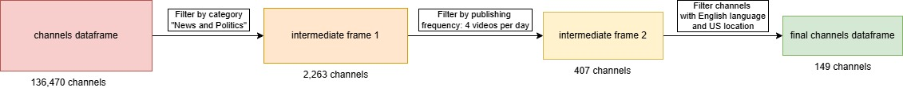
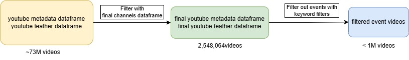
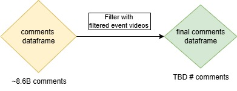

# The Spread of News During Crisis
## Abstract
A lot of people use YouTube as their source of news. In this project, we try to look at the news landscape on YouTube and see how the news is reported and how the public engages with it. For this, we analyze big US News Channels to see how they report on different events in the realms of politics, geopolitical conflicts, economic crises, and natural disasters happening in the US, Europe, and Asia. We will analyze if there are any overarching reporting trends or biases between these events, like video style or duration. Then we will look at the public response to these news videos to see if certain video features correlate with more engagement for a specific event. Based on that information we then want to formulate suggestions for what features could lead to a more effective video to start discussions or attract more viewership.

## Research Questions
- How does the reporting of events by US news channels change with respect to the type of event as well as its location?
- How is the public's response to an event affected by its nature, location, and video format through which it is presented?
- How does one make an effective news video to ellicit specific reactions and levels of interaction from the public?

## Proposed additional datasets
- We enriched our channel metadata set by adding the country of the channel using the [Youtube API](https://developers.google.com/youtube/v3).

## Methods
#### Filter the initial data: 
The Youniverse dataset is big. As we only focus on a fraction of the data we propose the following pipeline to get the data we need:
Below is a figure describing at a high level the filtering of the channels with a description below
 

- **Get the Channels of Interest (CoI):** 
    - Filter out all channels that do not belong to the category "News & Politics". For this, we use the df_channels_en.tsv dataframe.
    - We only focus on channels providing News Updates having a high activity. We only keep the channels with an average activity above 56 (corresponds to 4 videos per day for 2 weeks). For this, we use timeseries data the df_timeseries_en.tsv. 
        - To ease the handling of the big dataframes we do an initial filtering of yt_metadata.jsonl with the CoI obtained so far.
    - Even though the authors of the Youniverse dataset already filtered non-english speaking channels it turns out that there is still an important fraction of News channels in Hindi or other languages. We thus further filter the CoI obtained by the two previous steps using OpenAI's ChatGPT API to predict the language of the channel. For this, we sample 5 video titles and descriptions and pass them into a prompt asking the LLM to analyze the text to determine the channel's language. If any of the 5 videos is labeled non-English, the channel is removed from the dataset. 
    - We also obtain country information for a majority of the CoI. This was done with the YouTube Data API. Since the channel country data was fetched from today, we assume the country is the same as when the dataset was formed. Around 40-50 channels did not have their country of origin in the API data, so manual verification was performed, by visiting the channel page and/or other social media like X and Facebook.

- **Get the Videos of Interest (VoI)**  
Below is a figure describing at a high level the filtering of the videos 
  
    - Only keep videos from the CoI in yt_metadata.jsonl.
    - For every event get the VoI by searching the title, description, and tags with specific keywords.

- **Filter out relevant comments using VoI**   
Below is a figure describing at a high level the filtering of the comments
    

At this point, we have reduced the size of all the datafiles (except the comments). 

#### Analysis

The analysis is decomposed into two sections: 1. How does US News report on different events based on category and location? (i.e. studying the reporting side) 2. How does the public respond to events and specific video formats? 

To answer the first question, we look at videos related to each event, getting statistics for: 

    - video duration
    - type of video (live footage/analysis)
    - formatting of the title with capitalization 
    - frequency of video uploads at the time upload
    - subjectivity of the title

The type of video can be determined by filtering based on certain keywords in the title and description, by searching for specific keywords. We notices that the vast majority of videos that are about live footage include the terms "live" or "live footage" in either the title or description, so that allows us to seperate them from the rest.

With the statistics we can analyze how different events are reported and compare between events based on the locations and event category. Furthermore, by studying the evolution of the upload frequency for different events, we can visualize attention fatigue and determine what affects it and how it changes from event to event by estimating the rate of decrease of the upload frequency.

To answer the second question, we look at data relating to the public response to videos which are: 

    - views
    - number of comments
    - number of replies to comments
    - ratio of like/dislike

We would like to find correlations between the statistic of the first question and those of the public's response (using t and f tests to see the significance of correlation), potentially finding meaningful patterns. The goal of this is provide tips for useful features that news companies and NGO's can use to better engage users. 

Based on the metrics of the public's response we could classify the reaction into two main categories: relatively high view count and low comments/replies to comments, and average views with high comments/replies to comments. The first type would reflect virality and high reach of the video, while the second indicates that the video prompts strong user ungagement, encouraging discussions within the public. We could thereafter determine what format of videos result in high virality vs discussions, and news channels could adapt their videos according to the desired outcome. Like/dislike ratio could also be used to try determining how to potentially minimize division among the public (indicated by a ratio close to 1). 

## Proposed timeline and organization within the team
#### Week 1 (26.10.-01.11.):
- Find out how to treat big dataframes (🐋Lisa)
- Filter channels by category (🐋Lisa)
- Find three events in each category: geopolitical, natural, economical, political (🦖Leonie🦝Samuel🦔Jad🐦Jeffrey)

#### Week 2 (02.11.-8.11.):
- Filter channels by activity (🐋Lisa)
- Filter non-english channels using LLM (🐦Jeffrey)
- Prepare a list of keywords that would isolate specific events and filter out the related videos by searching in title and description (🦔Jad)
- Prepare statistical test pipeline (🦝Samuel)
- Get country information from channels using Youtube Data API (🐦Jeffrey)

#### Week 3 (9.11.-15.11.):
- ReadMe.md file (🐋Lisa)
- Analysis of video titles (🦖Leonie)
- Study of the upload frequency evolution for each event(🦔Jad)
- Filter the comments dataset on AWS (🐦Jeffrey)
- Correlation matrix over different values (🦝Samuel)

#### Week 4 (30.11.-06.12.):
- Filtering for events (🦔Jad)
- Improving correlation matrix over different values (🦝Samuel)
- Filter the comments dataset on AWS (🐦Jeffrey)
- make the website template (🦖Leonie)

#### Week 5 (7.11.-13.12.):
- create interactive plots (🐦Jeffrey)
- creat interactive plots (🐋Lisa)
- subjectivity score using LLM (🦖Leonie)
- Filtering for events (🦔Jad)

#### Week 6 (14.12.-20.12.):
- visualisation for video features (🐦Jeffrey)
- visualisation for pipeline (🐋Lisa)
- writing (🦖Leonie)
- classifying videos (🦔Jad)
- statistical analysis (🦝Samuel)

